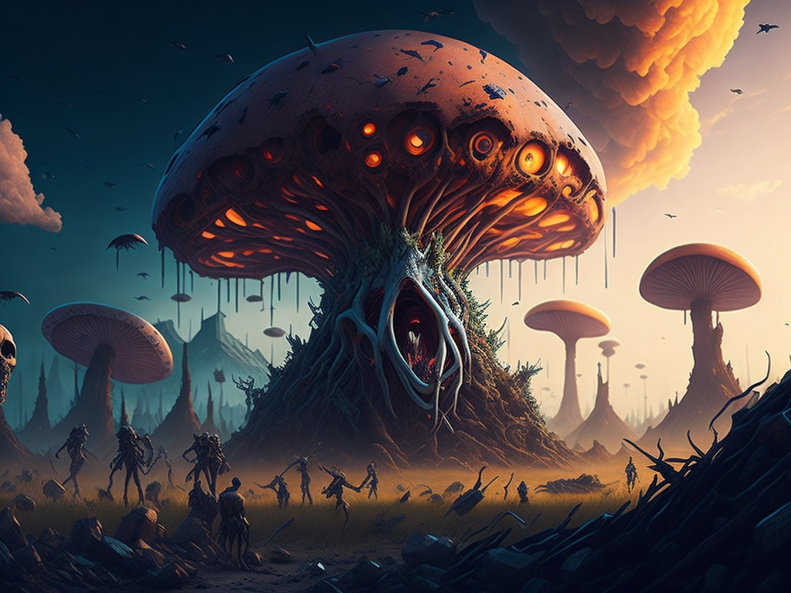

# Outbreak Orchestrator

In "Outbreak Orchestrator," players navigate a microscopic world, using fungi, parasites, and plants to control an ecosystem. From starting with fungal spores to manipulating larger creatures and human behavior, players enhance their abilities by collecting biological materials and delving into the realm of mind-controlling organisms. The gameplay combines strategy and clicker elements, allowing players to research, automate collections, and even influence global organizations, all while managing monetization aspects. Success is marked by system automation, innovations in mind control, and expanding one's domain, aiming to orchestrate a grand biological outbreak that decides the destiny of species and civilizations.

# REQUIREMENT  

- I want a game like Universal Paperclips
- Should be easy to build, html and javascript
- Alternate name: Brain Root
- **NOTE TO SELF**: Pace yourself, step by step, no rush. 
- **Remember**, the key to a successful clicker game is the **sense of progression**, so ensuring players feel rewarded and can upgrade or evolve their fungi will be essential!

# JOBS

Fully draw out all the boxes for shrooms, parasites, plants and viruses

## NOTES

Add in plot, you need to collect high volumes to deeply understand them.

# CHOSEN THEME 

## MECHANISM

	- COLLECT insects and PARASITES:   MUSHROOMS:  PLANTS:  VIRUSES
	- SELL, TRADE, DISPOSE
	- AMOUNT TO STUDY THRESHOLD MET
	- INVEST STUDY TIME: Assign % research time 
    - INFLUENCE ANIMALS/BEINGS: mutant controlling shroom/parasite/mechanism
    - Animal species automated to do your bidding
    - Improve control/influence over species
	- Upgrade research level
	- NEW COLLECTABLE STREAM
	- repeat

# FULL DESIGN

1. Game Intro: story about your job

Sequence of Events

PHASE 1: Dabbling with Biology

1. Collect Insect remnants (various ants)
2. Study threshold met at 100 clicks - you can now research your collected matter. 
Choose % of effort to study this matter. 
3. Research Initial investigation unlocked. This fills up like a bar. 
4. CONSUMPTION: Collected matter ticks down from losses due to being discarded after study.
5. Research deep insight unlocked - This fills up like a bar. Upgrade=everyclick multiplied by 2
6. Research zombify unlocked This fills up like a bar
7. Zombie Ants unlocked! Automate CORPSE harvesting/collection once research complete - press to automate. 
8. Collected matter ticks down from losses due to decomposition
9. You can begin selling matter to people and Universities
10. Money to buy more research equipment (unlock them)
12. Money can buy you better storage options (increasing your max)
11. Equipment unlocks new abilities to study (i.e. increased automation efficiency, reduce decomposition loss, new abilities - they can collect resources for you etc.)

FINALLY Once a certain threshold met, you unlock the ability to collect a different biological resource i.e. next one is rodant remnance. This moves to Phase 2

UNLOCKS FOR PHASE 1

- Automation
- Improved Automation 
- Collection multiplier
- New Buyers: First you can only sell to weirdoes, then drug addicts, then University students, then universities, then Big Pharma and so on. For Phase one, only will be Weirdoes.  
- Once Phase 2 is unlocked, you can maybe trade or convert your Insect remnants for rodant remnants at a price/rate of 0.25 to 1 ..still thinking aabout this. 

PHASE: MUTANT ARMY

- Decrease & Increase button Like von neuman drone design
- Explore, speed, Infection rate, Mutation Rate, Matter gathering.
- Collonise towns, cities, countries... 
- NEWS UPDATE: The Mutant Horde has taken Greece (+10000 domination)

2. A single button you tap to collect your first fungal item or insect item
3. Sell what you can to low tier buyers
4. ....

- Collect insect stuff
- invest time to study them
- unlocks ability to control animals/things to automate collecting faster: research level ++
- A certain threshold of collected items + research level opens up more parasite/insect material to collect which expands available things to control and influence
- eventually could have 5 to 10 different kinds of clicker boxes for the different collectables

- MUSHROOM, PLANT, VIRUS REPEAT

- at this point, the player has three different types, collecting multiple items within that type.  the cheaper, less valuable stuff gets automated more quickly so that feels like an achievement when you see those coming in and being collected.
- Eventually this builds up to taking over pharamaceutical companies, animal companies, then the market  then the world, then the unvierse!

- Advanced clicker tasks
- Mutant army Designer
- A increase/decreaste button to adjust % of fungi army, parasite army, plant army, another for exploration rate, infection rate, worker production, collector production etc. 

## Things to add:

- Virus creator 
MONEY 
- Sell to weirdoes, then drug makers/criminals, then universities, big pharma
- money for storage hold
- money to help buy support items
- money to pay off police and keep your activities hidden
- money for other things. 
- so the itmes above needs to be monopolised some how 

## FEATURES TO UNLOCK

- New Collectable Matter
- Automate collection
- Collection Rate
- Study Allocation efficiency level up
- Research level Up
- Stealth Level UP  

- Appease/influence/Take over:
	- Big pharma
	- Animals organisations
	- Stock Market
	- Governments
	- Alien civilizations

- Events
	- FUNGUY! A new rockband to gain global support

## Achivements & Progression mechanism example

- Add new collectable thing i.e. fungal fragment
- Collection automator
- Invention! Simple rodent controller 
- Research level upgrade
- Time invested efficiency upgrade
- Influence: Big pharma, Animal orgs, Stock Market, Government, Global Public
- Take over: All those above
- Appease: all those above (maybe first stage)

## Future

- COOPT UNI STUDENTS
	- PROPAGANDA: "INCREASE FUNGAL RIGHTS"
	- THEN CONSUME THEM 
	- PSYOPS IT
- WORLD BATTLE MAP
	- Take France, Take Belgium, Take Vietnam
- ALLIANCES
	- LEAVE SMALL GROUPS OF HUMANS ALONE
- SYMBIOSIS
	- TREAT CERTAIN GROUPS AS NEUTRAL
- HUMANS PUSH BACK
	- They create vaccines
	- you need to unlock counters

What's missing:

- clarity around money (or other similar thing to get support items, influence)
- Maybe some computer related stuff to get control over global IT systems?
- Other? Suggestions?

# SPECIFICS

1. **Micro-Control Parasites** (Controlling small animals):
    - **Mousikite**: Targets and manipulates small rodents.
    - **FeatherFluke**: Specializes in controlling avian species.
    - **Insectivox**: A parasite that influences insects, particularly ants.

2. **Emotion Manipulation Parasites** (Influencing human emotions):
    - **MoodMite**: Increases aggression in the host.
    - **SorrowSpore**: Causes feelings of deep sadness.
    - **JoyJelly**: Induces excessive happiness, making the host vulnerable.
    - **PanicPlague**: Causes anxiety and panic attacks in the host.

3. **Decision Making Parasites** (Influencing human decisioning):
    - **ChoiceChewer**: Manipulates the host's day-to-day decisions.
    - **WillWeaver**: Alters major life decisions, such as relationships or careers.
    - **ImpulseImp**: Causes erratic, impulsive actions.

4. **Physical Control Parasites** (Taking over bodily functions or movements):
    - **LocoLarva**: Controls the locomotion of a host, directing where they go.
    - **GestureGrub**: Manipulates fine motor skills, such as hand movements.
    - **SpinalSnare**: Latches onto the spine, allowing for full body control.

5. **Cognitive Parasites** (Influencing thoughts and memories):
    - **MemoryMoth**: Eats away at old memories, causing confusion.
    - **ThoughtThrip**: Plants new ideas or obsessions into the host's mind.
    - **DreamDrone**: Alters or controls the host's dreams.

6. **Zombification Parasites** (Converting humans into zombies):
    - **Zombee**: A bee-like parasite that stings humans, initiating the zombification process.
    - **NecroNematode**: A worm-like creature that invades the brain and shuts down higher thinking.
    - **DecayDiplozoon**: Turns human tissue necrotic, creating the appearance of decay.

7. **Stealth Parasites** (Hiding in hosts without detection):
    - **SilentSymbiont**: Remains dormant until activated by a specific trigger.
    - **CamouCyst**: Blends seamlessly with the host's body, nearly impossible to detect.

**1. Mycelial Controllers** (Manipulating animal or human behavior):
   - **SporeSire**: Influences emotions and thoughts of those who inhale its spores.
   - **PsycheShroom**: Induces hallucinations and alters perceptions.
   - **NeuroNetcap**: Taps into neural networks, controlling movements.

**2. Environment Manipulators** (Altering or controlling environments):
   - **MistMold**: Releases spores that create a dense, hallucinogenic fog.
   - **TerraTangle**: A mycelial network that reshapes landscapes to its whims.
   - **DuskDome**: A large mushroom cap that can block out sunlight, plunging areas into darkness.

**3. Physical Transformers** (Changing physical attributes of hosts):
   - **BulkBulb**: Enhances muscle growth for increased strength.
   - **StalkStretcher**: Causes hosts to elongate and become more tendril-like.
   - **PorePuff**: Causes the skin to become porous and sponge-like.

**4. Cognitive Mycelia** (Affecting memory, intelligence, and thought):
   - **WisdomWeb**: Enhances intelligence and cognition in hosts.
   - **ForgetFungus**: Causes memory lapses and short-term amnesia.
   - **DreamDewcap**: Alters the host's dreams or can even induce perpetual dreaming.

**5. Defensive Fungi** (Protecting areas or hosts):
   - **BarrierBolete**: Grows rapidly, forming walls or barricades.
   - **VenomVeil**: Releases toxic spores when threatened.
   - **GuardianGill**: Acts as a sentinel, alerting other fungi to intruders.

**6. Parasitic Shrooms** (Feeding off hosts for sustenance or control):
   - **LeechLichen**: Drains energy from its host.
   - **PossessPolypore**: Takes complete control over the host's body and mind.
   - **HollowHyphae**: Slowly consumes the host from the inside out.

**Collection/Click Items**:
   - **Mycelium Fragments**: Bits of root-like structures to be collected for power-ups or game currency.
   - **Spore Sacks**: Can be clicked on to release power-ups, or used as a crafting ingredient.
   - **Fungal Caps**: Colorful mushroom tops that can be harvested for various effects or sold/traded.
   - **Toxic Extract**: A rare drop that can be used to craft potent weapons or tools.
   - **Enchanted Compost**: Provides a growth boost to your fungi or can be traded with other players/NPCs.
   - **Luminous Lichen**: A light source in the game, or can be used to craft other items.
   - **Ancient Amber**: Contains preserved spores that can unlock ancient or powerful fungi.
   

**1. Micro-Control Parasites**:
   - **Rodent Remnants**: Tiny fragments of controlled rodents that can be harvested for power-ups or game currency.
   - **Feather Fragments**: Infected plumes that may unlock avian parasite upgrades.
   - **Insect Integuments**: Shed exoskeletons from controlled insects that can be used in various crafting recipes.

**2. Emotion Manipulation Parasites**:
   - **Mood Molecules**: Harvested from MoodMite hosts, used to craft emotional influence tools.
   - **Tears of Despair**: Collected from hosts influenced by SorrowSpore, possibly a rare ingredient for crafting.
   - **Happiness Hormones**: Extracted from JoyJelly's hosts, can be consumed for a temporary power-up or boost.

**3. Decision Making Parasites**:
   - **Neural Nodules**: Extracted from hosts to enhance your parasites' decision influencing capabilities.
   - **Will Whispers**: Ethereal remnants of major life decisions, can be used for advanced crafting.
   - **Impulse Ink**: Liquid extracted from ImpulseImp-controlled hosts, might be used to draft certain tools or weapons.

**4. Physical Control Parasites**:
   - **Locomotion Ligaments**: Harvested from hosts controlled by LocoLarva, perhaps used to enhance speed or movement.
   - **Gesture Gel**: Extracted from hosts, provides bonuses when influencing motor skills.
   - **Spinal Shards**: Rare fragments that can enhance a parasite's physical control abilities.

**5. Cognitive Parasites**:
   - **Memory Morsels**: Bits of consumed memories that can be used for various game enhancements.
   - **Thought Threads**: Harvested from hosts influenced by ThoughtThrip, might help in crafting or evolving your parasites.
   - **Dream Drops**: Liquid essences from dreams, potentially a rare and powerful item.

**6. Zombification Parasites**:
   - **Zombie Zest**: A common resource harvested from zombie hosts.
   - **Necrotic Nectar**: A rare extract from hosts, provides enhancements to zombification abilities.
   - **Decay Dust**: Ground-up residue from decayed hosts, used in a variety of crafting recipes.

**7. Stealth Parasites**:
   - **Silent Scales**: Collected from hosts, helps in crafting stealth-related items.
   - **Camouflage Crystals**: Enhances the parasite's ability to blend and hide within hosts.
   

# VISUALS

- Can show zombies as dots consuming others

# GENERAL THEME 

Possibly needs sorting 

**1. Early Game Mechanics - Insects and Parasites:**
   
   - **Starting Point**: You're a budding scientist studying parasites. You collect basic materials like Rodent Remnants, Feather Fragments, and Insect Integuments.
   
   - **Selling & Money**: Early on, these are sold to universities and labs for research. This gives you funds.
   
   - **Automation**: As you progress, you can create basic parasite traps, breeding habitats, and deploy controlled animals to fetch these materials for you.
   
   - **Research Points (RP)**: With every new specimen, you gain research points. These are critical for unlocking new levels, abilities, and automation tools.
   
   - **First Major Breakthrough**: Your research allows you to unlock basic control over rodents.

**2. Intermediate Game Mechanics - Mushrooms and Fungi:**

   - **Unlocking Fungi Studies**: After reaching a particular RP threshold, fungi become available.
   
   - **Fungi Collection**: Start with basic mushrooms like Spore Sacks. As your RP increases, unlock new and exotic fungi.
   
   - **Advanced Automation**: Use fungi to create spore traps and bio-reactors. This helps to amplify your collection rate.
   
   - **Fungal Control Over Animals**: With more advanced fungi, control larger animals, each with unique collection rates and abilities.

**3. Advanced Game Mechanics - Plants & Global Influence:**

   - **Plant Control**: After sufficient RP, tap into plant networks. They can be used to harvest resources, influence areas, or produce advanced compounds.
   
   - **Global Influence and Monetization**: Start by monopolizing the pharmaceutical market with revolutionary drugs. Control over animal organizations allows for advanced experimentation without ethical boundaries. Stock market control gives immense funds, while government control aids in avoiding legal repercussions.
   
   - **Global Infrastructure Control**: With sufficient funds, you can invest in tech companies. This opens the door for cybernetic enhancements, digital surveillance, and control over global IT systems. Here's where the computer element can come in.

**4. End Game and World Domination:**

   - **Create Hybrid Entities**: Use your vast resources to invent mutants. These entities combine the strengths of parasites, fungi, and plants.
   
   - **Global Takeover**: Use your hybrids to influence global leaders, public opinion, and institutions. Eventually, manipulate the masses and control their will.
   
   - **Galactic Exploration**: Use your vast wealth to invest in space exploration. Seed other planets with your creations and expand your domain.

**Additional Mechanics and Ideas:**

   - **Stealth & Subterfuge**: With increasing influence and power, there's also increased attention. Allocate funds to pay off police, lobby governments, and influence media to keep your activities hidden.

   - **Challenges & Threats**: Face challenges from rival scientists, ethical committees, global coalitions, etc. Counteract them with your resources, mutants, or influence.

   - **Economic Mechanism**: Introduce supply-demand mechanics. As you monopolize markets, the prices of goods, research, and influences can fluctuate.

   - **Support Items & Upgrades**: Use funds to purchase advanced labs, hire other scientists for collaborations, buy out companies for resources, or invest in R&D for faster progression.

   - **Random Events**: To keep gameplay engaging, introduce random events. These can range from natural disasters affecting your resources to breakthroughs doubling your RPs.

Your game has the potential for complexity, intrigue, and a lot of strategic depth, similar to Universal Paperclips but in a biological domain. Remember to have periodic check-ins with the player to keep them engaged and provide constant challenges and rewards.

# Discarded Ideas 

- Zombie simulator
	- experiment with diseases 
	- experiment with zombie animals
	- upgrade research level
	- show zombies as dots eating up crowds

- Hentai influencer

- Drone Commander [crawlers, flyers...space]

# ADVERTISING

- A new intelligence will emerge

# EXAMPLES FROM UNIVERSAL PAPERCLIPS

## Sample Mechanism from universal paperclips 

- Collection button
- + - price 
- Buy wire 
- Auto clippers

- Upgrade: 'market level'
- Upgrade: Auto buy wire

- Unlock, cheaper wire
- more wire
- faster auto clipper

INFO  Display

- Funds
- Unsold inventory
- price per clip
- marketing
- public demand

# FULL SYNOPSIS 

In "Outbreak Orchestrator," players embark on a unique journey through the microscopic world, harnessing the power of fungi, parasites, and plants to manipulate and control a vast ecosystem. Starting with simple fungal spores, players evolve their abilities, collecting various biological materials like Rodent Remnants, Feather Fragments, and Insect Integuments. As they progress, they delve deeper into the world of mind-controlling organisms, unlocking the potential to influence larger creatures and even human behavior.

The game blends elements of strategy and clicker mechanics, requiring players to invest time in research, boost their knowledge levels, and automate collections. Through their endeavors, players can influence and take over pharmaceutical companies, animal organizations, and even world governments, all while balancing the need to appease these entities. Monetization plays a role as players use funds for storage, equipment, influence, and keeping their operations covert.

Achievement is marked by unlocking new collectables, automating systems, inventing mind-controlling mechanisms, upgrading research capabilities, and expanding their influence from Earth to the universe. The overarching goal is not just to observe but to orchestrate a grand biological outbreak, determining the fate of entire species and civilizations.